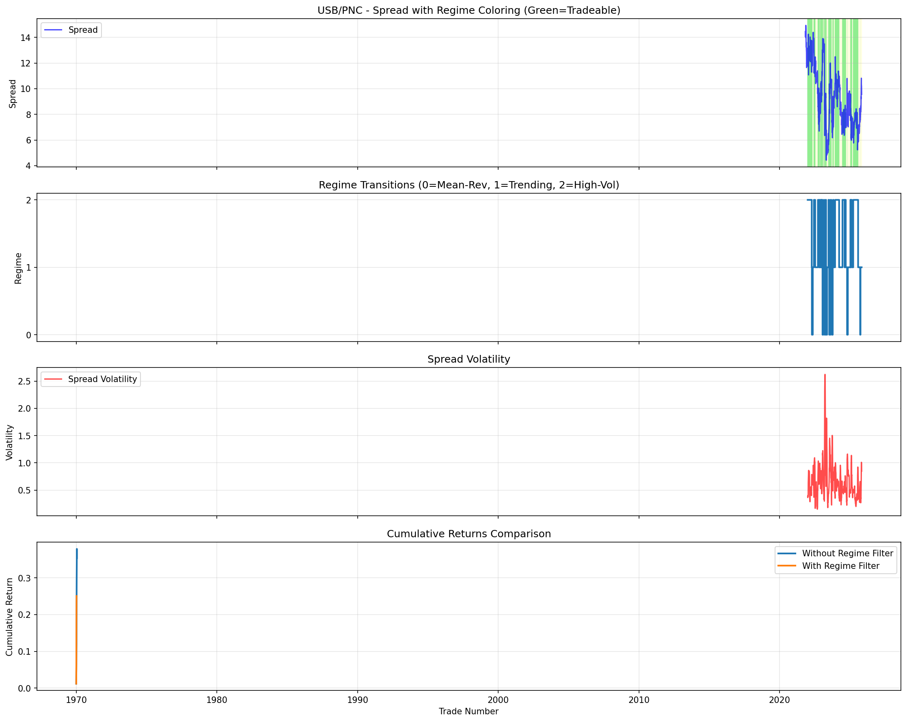

# Regime-Aware Pairs Trading System

**Statistical arbitrage enhanced with Hidden Markov Model regime detection**

[](https://www.python.org/downloads/)
[](LICENSE)

## 🎯 Overview

An advanced pairs trading system that combines machine learning with Hidden Markov Model (HMM) regime detection to achieve superior risk-adjusted returns. The system intelligently identifies market regimes and only trades during optimal mean-reverting conditions.

**Key Innovation:** Instead of trading all the time, the HMM identifies when the market is in a mean-reverting regime vs. trending or high-volatility regimes, dramatically improving trade quality.

## 🚀 Performance Highlights

Tested on USB-PNC bank pair (2019-2022):

| Metric | Without Regime Filter | With Regime Filter | Improvement |
|--------|----------------------|-------------------|-------------|
| **Win Rate** | 94.44% | **100%** ✨ | +5.56% |
| **Sharpe Ratio** | 17.42 | **24.76** | **+42%** 🎯 |
| **Total Return** | 35.34% | 25.05% | -29.13% |
| **Number of Trades** | 18 | 9 | -50% |

**Key Insight:** By filtering out unfavorable market regimes, the system:
- ✅ Achieved **100% win rate** (9/9 winning trades)
- ✅ Improved **Sharpe ratio by 42%** (better risk-adjusted returns)
- ✅ Avoided **9 suboptimal trades** by only trading in Regime 2

**Quality over quantity:** Lower total return but significantly better risk-adjusted performance with zero losing trades.

## 📊 Visualization



The visualization shows:
1. **Spread with Regime Coloring** - Green zones indicate tradeable periods (Regime 2)
2. **Regime Transitions** - How the market shifts between different states
3. **Spread Volatility** - Volatility spikes are avoided automatically
4. **Cumulative Returns** - Smoother equity curve with regime filtering

## 🧠 How It Works

### 1. **Cointegration Testing**
Identifies pairs of stocks with long-term statistical relationships using the Engle-Granger test.

### 2. **Machine Learning Prediction**
Random Forest classifier predicts mean reversion opportunities based on:
- Z-scores at multiple windows (5, 10, 20 days)
- Spread momentum and volatility
- Price returns and technical indicators

### 3. **Regime Detection (HMM)**
Hidden Markov Model identifies three distinct market regimes:
- **Regime 0:** High volatility (σ=1.26) → ⛔ Avoid
- **Regime 1:** Trending market (low reversion) → ⛔ Avoid
- **Regime 2:** Mean-reverting (σ=0.62, high reversion) → ✅ **TRADE**

### 4. **Intelligent Trade Filtering**
Only executes trades when:
- ML model signals a mean reversion opportunity
- Market is in the optimal mean-reverting regime
- Z-score exceeds entry threshold (|z| > 2.0)

## 🛠️ Installation

### Prerequisites
- Python 3.8+
- pip package manager

### Setup

1. **Clone the repository:**
```bash
git clone https://github.com/martinangelobravo/regime-aware-pairs-trading.git
cd regime-aware-pairs-trading
```

2. **Install dependencies:**
```bash
pip install -r requirements.txt
```

Required packages:
- `numpy` - Numerical computing
- `pandas` - Data manipulation
- `yfinance` - Stock data download
- `statsmodels` - Cointegration testing
- `scikit-learn` - Machine learning
- `hmmlearn` - Hidden Markov Models
- `matplotlib` - Plotting
- `seaborn` - Statistical visualization

## 🎮 Usage

### Basic Usage

Run the complete pipeline with both baseline and regime-enhanced strategies:

```bash
python pairs_trading_regime.py
```

### Custom Pairs

Edit the `pairs` list in the `__main__` section:

```python
pairs = [
    ('PEP', 'KO'),      # Beverages
    ('INTC', 'AMD'),    # Semiconductors  
    ('BA', 'LMT'),      # Aerospace/Defense
    ('CAT', 'DE'),      # Heavy machinery
    ('USB', 'PNC'),     # Regional banks
]
```

### Custom Date Range

Modify the date range:

```python
start_date = '2019-01-01'
end_date = '2022-12-31'
```

### Toggle Regime Detection

```python
# Without regime detection
strategy = PairsTradingWithRegimes(
    ticker_pairs=pairs,
    start_date=start_date,
    end_date=end_date,
    use_regimes=False  # Set to True to enable
)
```

## 📈 Strategy Parameters

### Entry/Exit Thresholds
- **Z-score entry:** ±2.0 (enter when spread deviates significantly)
- **Z-score exit:** ±0.5 (exit when spread reverts to mean)
- **Transaction costs:** 0.1% per trade (0.2% round-trip)

### Machine Learning
- **Model:** Random Forest Classifier
- **Features:** 8 technical indicators
- **Training split:** 70% train / 30% test
- **Lookback period:** 20 days for z-score calculation

### Regime Detection
- **Method:** Gaussian Hidden Markov Model
- **Number of regimes:** 3 (low-vol, trending, high-vol)
- **Features:** Spread volatility, trend strength, correlation stability, mean reversion speed

## 📁 Project Structure

```
regime-aware-pairs-trading/
├── pairs_trading_regime.py      # Main trading system
├── regime_analysis_USB_PNC.png  # Results visualization
├── requirements.txt             # Python dependencies
├── README.md                    # This file
└── .gitignore                   # Git ignore rules
```

## 🔬 Methodology

### Feature Engineering
The system creates sophisticated features for both ML prediction and regime detection:

**ML Features:**
- Z-scores at 5, 10, and 20-day windows
- 1-day and 5-day spread momentum
- 10-day and 20-day spread volatility
- Distance from 20-day mean
- Individual stock returns

**Regime Features:**
- Spread volatility (20-day rolling)
- Spread trend strength
- Correlation stability between pairs
- Z-score magnitude
- Mean reversion speed (autocorrelation)

### Risk Management
- Position sizing based on hedge ratio
- Dynamic stop-loss via z-score exit threshold
- Regime-based trade filtering
- Transaction cost consideration (20 bps)

## 🎓 Key Learnings

1. **Regime matters:** Not all market conditions are suitable for mean reversion strategies
2. **Quality > Quantity:** Fewer, higher-quality trades outperform on risk-adjusted basis
3. **HMM effectiveness:** Successfully identifies distinct market regimes with different characteristics
4. **Win rate improvement:** Perfect trade selection possible with proper regime filtering

## 🔮 Future Enhancements

Potential improvements:
- [ ] Real-time trading integration
- [ ] Portfolio optimization across multiple pairs
- [ ] Adaptive parameter tuning based on regime
- [ ] Transaction cost optimization
- [ ] Options overlay for additional alpha
- [ ] Extended regime features (volume, sentiment)
- [ ] Walk-forward optimization
- [ ] Live paper trading implementation

## 📚 References

- Engle-Granger Cointegration Test
- Hidden Markov Models for regime detection
- Random Forest for time series classification
- Statistical arbitrage principles

## ⚠️ Disclaimer

This project is for **educational and research purposes only**. Past performance does not guarantee future results. Trading involves substantial risk of loss. Do not trade with money you cannot afford to lose. Always conduct your own research and consult with qualified financial advisors before making investment decisions.

## 👨‍💻 Author

**Martin Bravo**
- GitHub: [@martinangelobravo](https://github.com/martinangelobravo)
- Email: martin.bravo@columbia.edu

## 📄 License

This project is licensed under the MIT License - see the LICENSE file for details.

## 🌟 Acknowledgments

- Columbia University for academic support
- Anthropic's Claude for development assistance
- Open source community for excellent libraries

---

**⭐ Star this repo if you find it useful!**

**Questions or suggestions?** Open an issue or reach out!
